## Table of contents
* [FootballTransfers](#footballtransfers)
* [Technologies](#technologies)
* [Setup](#setup)
* [Control-flow diagram](#control-flow-diagram)
* [Features](#features)
* [Sources](#sources)

# FootballTransfers

The theme of the project is to present statistics on the largest football transfers. The data was taken from the kaggle.com website [1]. They represent the 250 most expensive transfers from the 2000/2001 season to the 2018/2019 season.

## Technologies

- Angular 8 - freamwork for creating web applications supported by google
- HTML 3 - hypertext markup language used to create pages
- CSS - cascading style sheet
- ng2-charts - charting package based on chart.js
- chart.js - library for creating charts
- Hightcharts - package for creating charts
- JavaScript  - scripting programming language
- TypeScript  - a free programming language created by Microsoft, is a superset of the JavaScript language
- Bootstrap - a CSS library that facilitates the creation of a graphical interface.

## Setup

The node.js runtime environment is required to run the application. After installing it, run the command line and then go to the main directory of the project. In the console, enter the command ng serve which will start our application. The next step is to open any web browser and enter the address of the local host: localhost: 4200. The application start page will load in your browser.

## Control-flow diagram
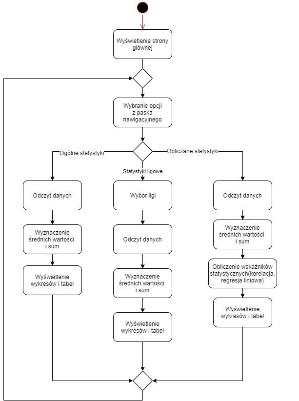

## Features

There are three tabs in the application:
- League" tab presents the analysis with the possibility of choosing a specific league
- Total" tab presents analysis of overall data
- Correlations" tab presents a detailed analysis of the data along with the associations of specific attributes
All charts in the application are interactive, hovering over them with the mouse displays detailed data, and clicking on the label omits a specific attribute in the data visualization on the chart.

Main page: 
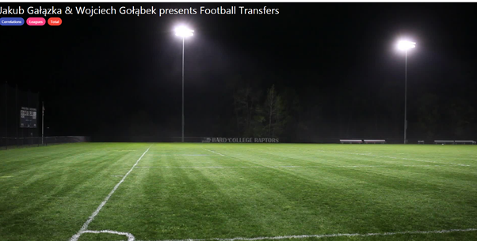

Carts and dependencies on the site:

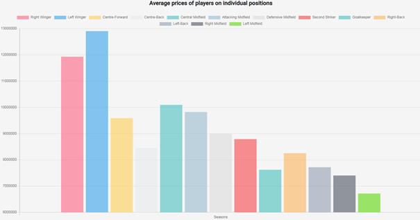

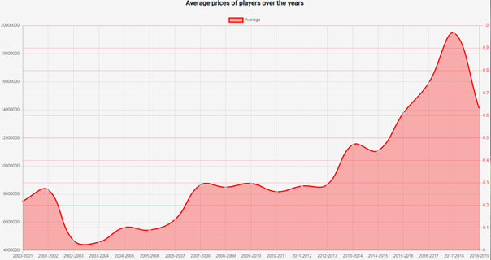

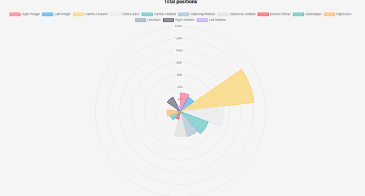

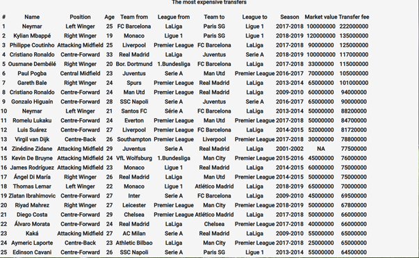

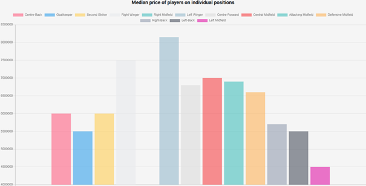

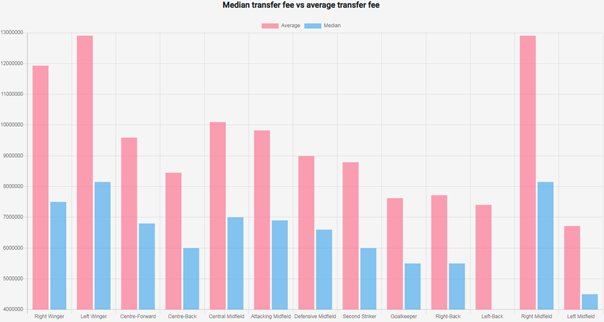

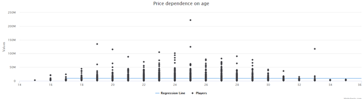

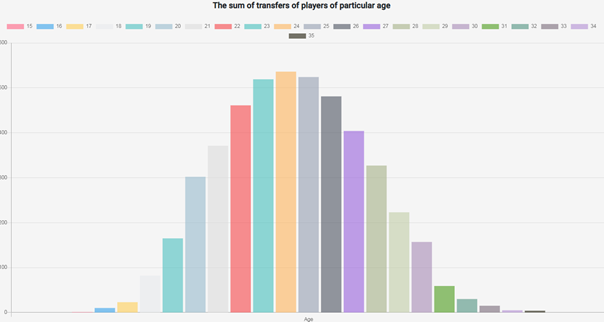

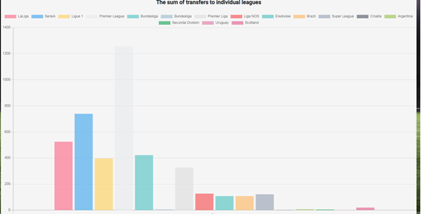

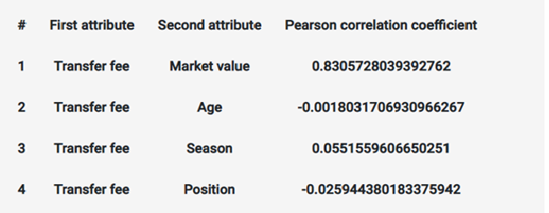

There are other charts in the application. They relate to individual leagues.

## Sources

 [1] https://www.kaggle.com/
